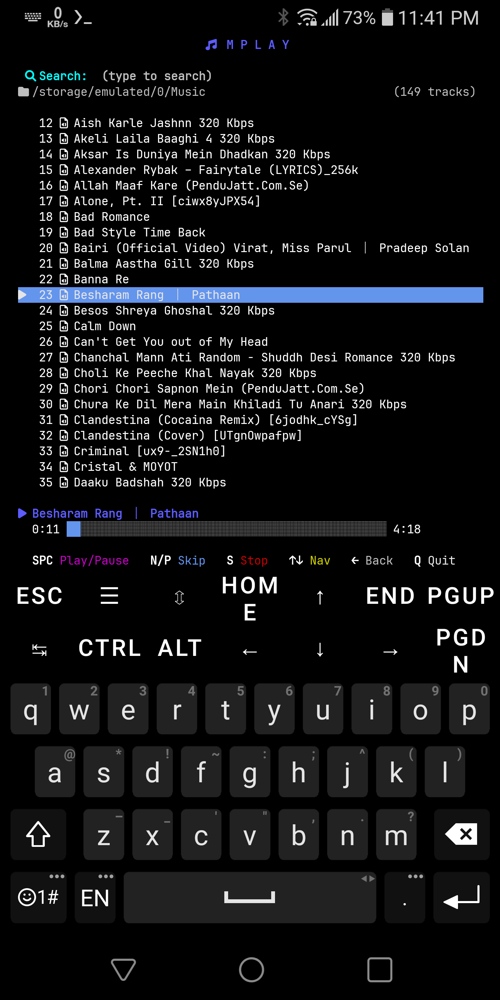

# 🎵 mplay

A minimalist, high-performance terminal music player and file explorer designed specifically for **Termux** and low-resource environments. Built with a sleek **Nerd Font** interface and powered by `mpv`.



## ✨ Features

- **📂 Integrated File Explorer:** Navigate your entire storage from the CLI. Starts at `~/` by default.
- **🔍 Real-time Search:** Instantly filter folders and music files as you type.
- **🎨 Modern TUI:** Sleek blue-themed progress bars and vibrant, adaptive shortcut legends.
- **⚡ Intuitive Controls:** Optimized for one-handed navigation in Termux using arrow keys.
- **⏩ Double-Tap Seek:** Tap N/P once to skip tracks. Tap N-N or P-P within half a second to jump forward/back within the current track.
- **💿 Spinning Disc Indicator:** The play/pause icon in the Now Playing bar spins like a real disc while a track plays, and freezes when paused.
- **🔊 In-app Volume Control:** Adjust mpv's volume with `+`/`-`, independent of the notification panel.
- **🎧 Auto-Advance:** Plays through your entire folder or filtered search results automatically.
- **🛡️ Robust & Stable:** Built with `blessed` to handle terminal quirks and resizing gracefully, and logs errors instead of crashing mid-song.

## 🚀 Installation (Automated)

The easiest way to install everything is using the provided `install.sh` script.

```bash
chmod +x install.sh
./install.sh
```

**The installer will automatically:**
1. Update your system.
2. Install **System Packages:** `mpv`, `python`.
3. Install **Python Libraries:** `blessed`.
4. Set up the `mplay` **terminal shortcut/alias**.
5. Check whether Termux's volume keys are set up to reach mpv (see [Volume Control](#-volume-control) below).

### 🎨 Nerd Fonts
To see the icons correctly, ensure you have a [Nerd Font](https://www.nerdfonts.com/) installed in your terminal emulator (like Termux-Styling).

## ⏩ Shortcuts & Accessibility

### 1. Terminal Command
After running `install.sh`, you can launch the app from anywhere by simply typing:
```bash
mplay
```

### 2. Termux Widget (Home Screen Icon)
If you have the [Termux:Widget](https://github.com/termux/termux-widget) app installed:
1. Create the shortcuts directory: `mkdir -p ~/.shortcuts`
2. Copy the widget script: `cp mplay.sh ~/.shortcuts/`
3. Make it executable: `chmod +x ~/.shortcuts/mplay.sh`
4. Now, add the Termux Widget to your Android home screen and select `mplay.sh` to launch it instantly!

## 🎮 How to Use

Launch from anywhere:
```bash
mplay
```
Or browse a specific folder directly:
```bash
mplay ~/storage/shared/Music/
```

### Keyboard Shortcuts

#### 📂 Explorer Mode (Browsing)
- **↑ / ↓**: Navigate list
- **→ / ENTER**: Open Folder / Play Song
- **←**: Go Back to parent folder
- **Type anything**: Start searching/filtering (works for any letter that isn't a shortcut)
- **/**: Start a search explicitly — needed if the title starts with n, p, q, s, space, +, or -,
  since those are also shortcuts. Once you've pressed `/`, every key goes to the search box.
- **BACKSPACE**: Delete the last search character (does nothing outside search — use ← to go back)
- **ESC**: Clear search and exit search mode

#### 🎵 Player Mode (Listening)
- **SPACE**: Toggle Play/Pause
- **N**: Tap = Next track · Double-tap (within 0.5s) = Fast-forward 5s in current track
- **P**: Tap = Previous track · Double-tap (within 0.5s) = Rewind 10s in current track
- **+ / -**: Volume up / down
- **S**: Stop playback
- **Q**: Quit Application

> **Note on N/P timing:** a terminal only sees key presses, never releases, so the only way to
> tell "one tap" from "two taps" apart is to briefly wait after the first press to see if a
> second one follows. That means a single N/P tap now skips the track after a short pause (up
> to ~0.5 seconds) instead of instantly. If a second matching tap lands within that half-second,
> the skip is cancelled and it seeks within the currently playing track instead.

## 🔊 Volume Control

mplay adjusts mpv's own volume with `+` / `-` while a track is playing — this always works,
regardless of device or keyboard.

The Android hardware volume rocker normally also works, since it controls the system media
stream mpv is playing through. If it doesn't, it's because Termux has been configured to use
the volume keys for its own "special keys" row instead of passing them through as normal
volume control. `install.sh` checks this automatically and will tell you if that's the case.
To fix it manually:
1. Open `~/.termux/termux.properties`
2. Remove or comment out any `volume-keys = special-keys` line
3. Run `termux-reload-settings`

## 🛠️ Troubleshooting

mplay no longer crashes the terminal on errors (missing mpv, a dropped playback socket, a
resize glitch, etc.) — it logs them instead and keeps running. If something looks off, check:
```bash
cat ~/.cache/mplay/mplay.log
```

## 🛠️ Technical Specs
- **Backend Player:** `mpv` (System Package)
- **Primary Library:** `blessed` (Python Library)
- **Dependency Management:** `install.sh`
- **Icon Set:** Nerd Font (v3.0+)

---
*Built with ❤️ for the Termux community.*
